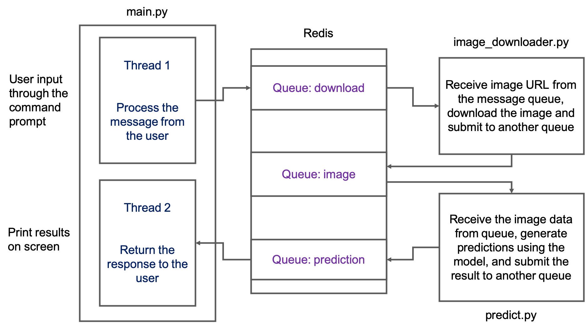
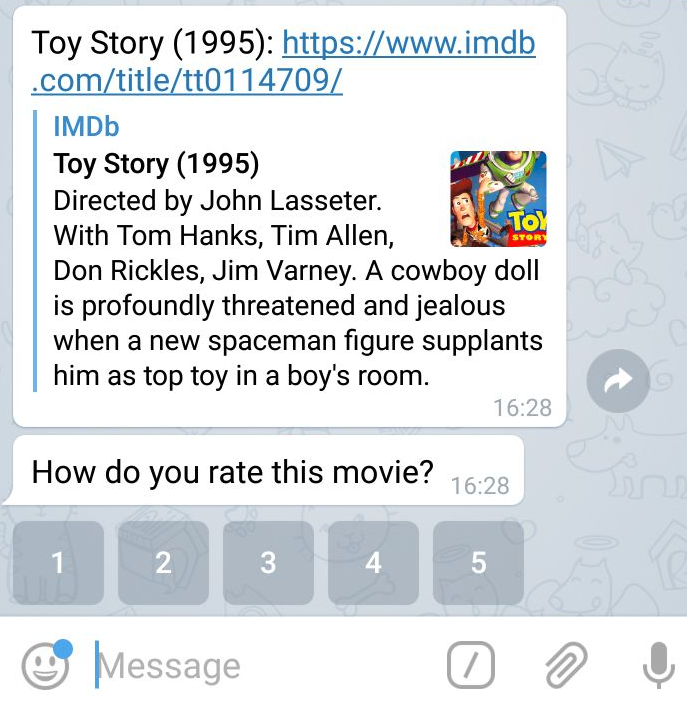

# IEMS5780 / IERG4080 Assignment 3

## Movie Recommender System

* **Deadline**: 2nd December, 2018 (Sunday)
* **Total Marks**: 100

## Objectives

* To get familiar with building **HTTP applications**
* To get familiar with creating a **Flask application** in Python
* To get familiar with different basic concepts in **recommender systems**

## Tasks

In this assignment, you will build a movie recommender system using some **memory-based recommendation algorithms**. The system should be deployed as a Telegram bot and a Web application server.

Your recommender system should at least consists of two parts:
1. A python script **`bot.py`** that continues to receive user messages from Telegram. When a message from a user is received, it sends request(s) to the recommendation server, and formats a response to be sent back to the user via Telegram.
2. A python script **`app.py`** that implements an HTTP server using Flask. It should provide different routes to accept requests to different functions (see more details below).

The system should provide the following functions:
1. Accepts a new user identified by the **`chat_id`**
2. Returns a movie that has not yet been rated by a user so that the user can provide his/her rating on the movie
3. If enough ratings have been collected from a user, use the **user-based collaborative filtering** algorithm to generate recommended movies to the user

<center>
    
</center>

More details about how the system should be implemented are described below.

### Dataset

We will use a dataset commonly used in recommender systems research, the **MovieLens 100K movie ratings dataset** created by GroupLens at the University of Minnesota. Check the Website [https://grouplens.org/datasets/movielens/](https://grouplens.org/datasets/movielens/), and read the section "recommended for education and development". We will use the **small** dataset with 100,000 ratings.

The dataset consists of 100,000 ratings on different movies by the users of the MovieLens recommender system:
- 100,000 ratings (1-5) from **600 users** on **9,000 movies**
- Each user has at least 20 movies
- Data about the movies and the users

You can read the README file here: [http://files.grouplens.org/datasets/movielens/ml-latest-small-README.html](http://files.grouplens.org/datasets/movielens/ml-latest-small-README.html)

**NOTE**: The original dataset may be too large for this assignment. If it takes a long time to compute predictions, you can use a smaller dataset available here: [https://github.com/iems5780/1819t1/blob/master/assignments/ratings.small.csv](https://github.com/iems5780/1819t1/blob/master/assignments/ratings.small.csv). This dataset is created by filtering away movies with less than 20 ratings, and users with less than 50 ratings. This dataset has ratings from 330 users on 1,235 movies.

### The Telegram Bot Script

The Telegram bot script `bot.py` is used to rely user input to the server, and the server's output back to the user. In this assignment, you **do NOT** have to use a separate thread to communicate with the server. You can handler messages **sequentially** (i.e. one after another).

For this assignment, create a new Telegram bot, and use the `\setcommands` function in the BotFather bot to create **three commands** for your bot (see [https://core.telegram.org/bots#6-botfather](https://core.telegram.org/bots#6-botfather)). The user can use these three commands to interact with your recommender system.

* `/start`
    - A command to register with the application. On receiving this command, the Telegram bot script should:
        1. Send a request to the server's `/register` API with the user's `chat_id`, to check whether the user is a new user or an existing user
        2. If user is new, reply "Welcome!", otherwise reply "Welcome back!"
* `/rate`
    - A command to ask the application to present a movie for rating. On reciving this command, the Telegram bot script should:
        1. Send a request to the server's `/get_unrated_movie` API with the user's `chat_id`
        2. On receiving the movie information from the server, send the user two messages:
            - A message containing the name of the movie, and the URL to the movie's page on IMDB
            - A message asking for the user's rating on this movie, with a custom keyboard
    - Note that you should store the movie's ID in the callback data, such that you know which movie the user has rated when you receive the user's rating
    - When a movie rating is received, you should send a request to the server's `/rate` API to submit the rating
    - An example is shown below

<center>
    
</center>

* `/recommend`
    - A command to ask the application to recommend a list of movies based on previous ratings. On receiving this command, the Telegram bot script shoud:
        1. Send a request to the server's `/recommend` API to ask for the **top 3** recommended movies for this user.
        2. The server may return two different responses, depending on the number of ratings given by that user:
            - If the user has **10 or more** ratings, the server will return a list of recommended movies
            - If the user has **less than 10** ratings, the server will return an empty list
        3. Upone receiving the response from the server:
            - If the list is not empty, send the list of movies to the user in **separate messages** to the user. Each message contains the title and the URL of the movie's page on IMDB.
            - if the list is empty, send the following message to the user: **"You have not rated enough movies, we cannot generate recommendation for you"**.

**Hint**: You can refer to the [sample bot script](https://github.com/iems5780/1819t1/blob/master/assignments/assignment-3-sample-bot.py) to see how you can structure your handle function to handle commands from the users.

### The Application Server

The application server should be a **Flask application** that accepts **HTTP requests** on different routes.

You should load **ALL** user ratings when initializing the application. For example, you can create a **dictionary** for storing the user's ratings. The key is the user's ID, and the value is a **numpy array** containing the user's rating on different movies.

You may also have to load additional data in the application when it is started, such as the titles and IDs of the movies.

**Hint**: You can add attributes to the Flask application when initializing it, and then in the function of a route you can use `current_app` to get a reference to the application (see example below).

```python
from flask import Flask, current_app

app = Flask(__name__)

# Store something in the "data" attribute
# of the Flask application
app.data = "Some data"

@app.route('/')
def index():
    # Returns "Some data"
    return current_app.data
```

All the **routes** in your Flask application should receive **POST** requests with **JSON data**. They should also send out responses in **JSON format**.

Your Flask application should have the following **routes**:

* `/register`
    - An API for checking whether a user exists in the application
    - It receives JSON data in the form of<br/>`{"chat_id": "(chat ID of the telegram user)"}`
    - If the application has seen this chat ID before, the following JSON response:<br/>`{"exists": 1}`
    - If the application has not seen this chat ID before:
        - Creates a new user and initialize its item ratings to zeros
        - Return the following JSON response:<br/>`{"exists": 0}`
* `/get_unrated_movie`
    - An API for obtaining a movie that is **NOT yet** rated by the user
    - It receives JSON data in the form of<br/>`{"chat_id": "(chat ID of the telegram user)"}`
    - The function handling this API should randomly sample a movie that is not yet rated by the user, and return the movie ID, the title and the URL to the movie's page on IMDB in the following format:<br/>`{"id": 1, "title": "Toy Story (1995)", "url": "..."}`
    - Note that you may need to **generate the URL** of the movie's page using the movie's ID in the dataset
* `/rate_movie`
    - An API for submitting a movie rating form a user
    - The function handling this API should updating the array of movie ratings of the given user with the rating provided
    - It should accept JSON data in the following format:<br/>`{"chat_id": "...", "movie_id": 1, "rating": 5}`
    - On updating the data in the application, it should return the following JSON response:<br/>`{"status": "success"}`
* `/recommend`
    - An API for generating recommended movies for a given user
    - The function handling this API should use the **user-based collaborative filtering** approach to compute the predicted ratings of all movies, and return the **top N** movies as specified in the request JSON
    - **Note**: the API should return an **empty list** if the number of movies rated by the user is **less than 10**
    - The API expects the following JSON input data:<br/>`{"chat_id": "...", "top_n": 3}`
    - It should return the list of movies in the following format:

```javascript
{
    "movies": [
        {
            "title": "...",
            "url": "..."
        },
        {
            "title": "...",
            "url": "..."
        },
        ...
    ]
}
```

**Note:** We DO NOT use a database in this assignment. Hence, if you restart the application, all the users' ratings will be gone (except, of course, the ratings from the MovieLens dataset). To facilitate testing, you can consider adding ratings to your own Telegram user (check the "chat ID" of yourself) when the application starts.

## What to Submit

You should prepare **two files** to be submitted for this assignment:
* **bot.py**: the script in which you implement the Telegram bot
* **app.py**: the script in which you implement the Flask application for movie recommendation

You should put these two files in a folder named <student_id>_assignment3 (e.g. 12345678_assignment3), and compress it into a zip file (e.g. 12345678_assignment3.zip). Submit the compressed file to Blackboard.
