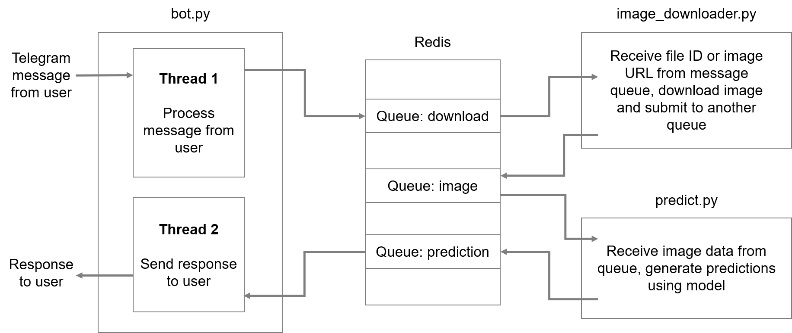

# IEMS5780 / IERG4080 Assignment 4

## Asynchronous Messaging

* **Deadline**: 22nd December, 2018 (Saturday)
* **Total Marks**: 100

## Objectives

* To get familiar with using **asynchronous messaging** in network applications

## Tasks

In this assignment, you will create an application that performs object recognition using a deep learning model, which is very similar to the one in Assignment 2. However, we will make some changes to the system by replacing direct TCP connections with **asychronous messaging** using **Redis**.

The following diagram illustrate the **system architecture** of the application.



There are three components in this system:
1. **`bot.py`**: a program that keep receiving user messages from Telegram, and is also responsible for sending response back to the user
2. **`image_downloader.py`**: a program that is responsible for downloading images from either Telegram or a given URL
3. **`predict.py`**: a program that loads a PyTorch pre-trained model for object recognition, and generates predictions when given an image

**NOTE** that you should NOT use the publish/subscribe mechanism of Redis in this assignment. You should use **lists** in Redis to implement message queues. Refer to the slides in Lecture 12 for more information: [https://iems5780.github.io/1819t1/lectures/lecture-11.html#28](https://iems5780.github.io/1819t1/lectures/lecture-11.html#28)

### The Bot Script

In the Bot Script (`bot.py`), you should implement logic that performs the following:

* Continuously receiving user messages from Telegram
* Whenever a message is received, **if** the message contains an **image**, or **if** the message's text has an **URL** inside, create a message and submit it to a message queue in Redis named **`download`**. The message should be JSON-encoded, which contains the following data:
    1. `chat_id` of the user
    2. `file_id` of the image (IF it is an image submitted via Telegram)
    3. `url` of the image (IF it is an URL submitted by the user in the message)
* In **another thread**, keep listening for message from another message queue named **`prediction`**. The message from that queue should contains the predictions and the `chat_id` of the corresponding user. Send the predictions back to the user.
* If the message does not contain an image or a URL to an image, **nothing** has to be done

### The Image Downloading Script

In the Image Downloading Script (`image_downloader.py`), you should implement logic that performs the following:

* Continuously receiving messages from the message queue **`download`** in Redis.
* Once a message is recevied, depending on whether it is a file ID from Telegram or a URL given by the user, you should download the image using corresponding methods (**refer to instructions in Assignment 2**)
* Encode the binary data of the image and submit a message to a message in Redis named **`image`**. The message should be JSON-encoded, which contains the following data:
    1. `chat_id`
    2. Base64-encoded binary data of the image

### The Prediction Script

In the Prediction Script (`predict.py`), you should pre-load a **PyTorch pre-trained InceptionV3 model** when it is first started. You can refer to the notebook to see how the model can be loaded and how predicted labels can be obtained: [https://github.com/iems5780/1819t1/blob/master/notebooks/l6_example_pytorch_inceptionv3.ipynb](https://github.com/iems5780/1819t1/blob/master/notebooks/l6_example_pytorch_inceptionv3.ipynb). (NOTE: this is different from Assignment 2, where we used a Keras pre-trained model.)

In this script, you should implement logic that performs the following:
* Continuously receiving messages from the message queue **`image`** in Redis.
* Once a message is received, decode the image data in the message, preprocess it, and feed it into the PyTorch model to generate predictions
* Once you have the predictions, submit a message to the message queue `prediction` so that the Bot Script can receive the predictions. You only need to send back the **top 5** predicted labels. The message should be in the following format (similar to Assignment 2, and JSON-encoded):

```python
{
    "predictions": [
        {"label": "container_ship", "score": 0.4625},
        {"label": "lifeboat", "score": 0.1579},
        {"label": "wreck", "score": 0.1383},
        {"label": "pop_bottle", "score": 0.0477},
        {"label": "dock", "score": 0.0406},
    ],
    "chat_id": <chat_id>
}
```

NOTE: the scores returned by the PyTorch model are not probabilities. You can simply output whatever the model gives you, there is no need to convert the scores into probabilities.

### Load Balancing

Once you have finished all the scripts. You can experiment with starting multiple instance of `image_downloader.py` and `predict.py`. You should see that they will consume messages from the message queues alternatively, which the need to do any configurations on the scripts.

## What to Submit

You should prepare **three files** to be submitted for this assignment:
* **bot.py**: the script in which you implement the Telegram bot
* **image_downloader.py**: the script in which you implement the image downloading logic
* **predict.py**: the script in which you implement the logic of generating predictions using a pre-trained PyTorch model

You should put these two files in a folder named <student_id>_assignment4 (e.g. 12345678_assignment4), and compress it into a zip file (e.g. 12345678_assignment4.zip). Submit the compressed file to Blackboard.
